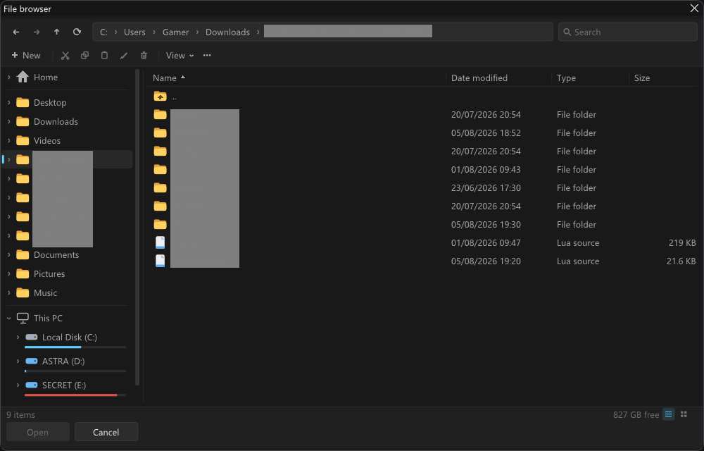
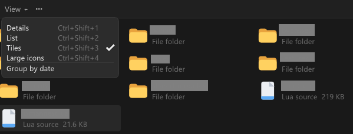
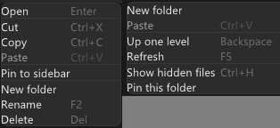

# filebrowser.h

A Windows-Explorer-style file browser for [Dear ImGui](https://github.com/ocornut/imgui), in a single header.

Drop one file into your project, include it, and you get a real file browser: a navigation tree that
mirrors your actual Windows Quick access pins, live drives with volume labels and capacity bars, four
view modes, drag-and-drop, and the file operations you'd expect from a right-click.



## Getting started

Copy `filebrowser.h` next to your Dear ImGui headers and include it.

```cpp
#include "imgui.h"
#include "filebrowser.h"

static imex::FileExplorer browser;

// ...inside your ImGui frame
ImGui::Begin("File browser");

switch (browser.Draw())
{
case imex::FileExplorer::Action::Open:
    LoadFile(browser.SelectedPath());
    break;
case imex::FileExplorer::Action::Cancel:
    showBrowser = false;
    break;
default:
    break;
}

ImGui::End();
```

`Draw()` fills whatever window you call it in, and returns `Action::Open` on the frame the user
double-clicks a file or presses **Open**.

**Requirements**

- C++17 (uses `<filesystem>`)
- Dear ImGui 1.87 or newer
- Windows: links `Shell32`, `Ole32` and `Uuid` automatically via `#pragma comment`

It also compiles on Linux and macOS, where drives collapse to `/`, Quick access falls back to `$HOME`
and its standard subfolders, and delete is a plain remove instead of a trip to the Recycle Bin.

## As a modal dialog

The same browser works as an open-file dialog. Call `ImGui::OpenPopup` once, then call
`DrawPickerModal` every frame.

```cpp
if (ImGui::Button("Open file..."))
    ImGui::OpenPopup("Open file");

if (browser.DrawPickerModal("Open file") == imex::FileExplorer::Action::Open)
    LoadFile(browser.SelectedPath());
```

Pass `true` as the second argument to pick a folder instead of a file:

```cpp
browser.DrawPickerModal("Choose a folder", /*foldersOnly=*/true);
```

## Features

**Navigation tree.** The Quick access section is read from the real Windows Quick access shell folder,
so whatever you pinned in Explorer shows up here too. Below it, This PC lists every drive with its
volume label, type and a used/free capacity bar that turns red past 90% full. Plug in a USB stick and
it appears within two seconds.

**Four view modes.** Details, List, Tiles and Large icons, switchable from the toolbar or with
<kbd>Ctrl</kbd>+<kbd>Shift</kbd>+<kbd>1</kbd>..<kbd>4</kbd>. Icons are drawn with `ImDrawList`, so
there is no icon font to ship.



**Drag and drop.** Drag a selection onto a folder row, a sidebar node, or the `...` row to move it
there. Hold <kbd>Ctrl</kbd> while dropping to copy instead. Moves across volumes fall back to
copy-then-delete automatically.

**Right-click menus.** Items get Open, Cut, Copy, Paste, Pin, New folder, Rename and Delete. Empty
space gets New folder, Paste, Up one level, Refresh, hidden-file toggle and Pin this folder.



**The rest.** Breadcrumb address bar drawn as a real address field: each segment is clickable, and
clicking the empty part of it (or pressing <kbd>Ctrl</kbd>+<kbd>L</kbd>) turns it into a text box with
the current path selected. Plus back/forward/up history, search box, multi-select with
<kbd>Ctrl</kbd> and <kbd>Shift</kbd>, natural sorting with folders first, optional grouping by date,
inline rename, and delete via the Recycle Bin with a confirmation dialog.

## Options

| Call | What it does |
| --- | --- |
| `SetUiScale(float)` | Density, default `0.85`. Lower packs more rows in. Scales padding, spacing, row heights and icons, never the font, so it is safe on any ImGui version. |
| `ShowFooter(bool)` | Hide the Open/Cancel row when you are embedding the browser as a plain panel. |
| `SetViewMode(ViewMode)` | `Details`, `List`, `Tiles` or `Icons`. |
| `ShowHiddenFiles(bool)` | Show hidden and system files. |
| `SetConfigPath(path)` | Where settings and pins are stored. Pass an empty path to keep everything in memory. |
| `Navigate(path)` | Jump to a folder. |
| `Pin(path)` / `Unpin(path)` / `IsPinned(path)` | Manage your own Quick access pins. |

Reading results:

| Call | Returns |
| --- | --- |
| `SelectedPath()` | The focused item, or an empty path if nothing is selected. |
| `SelectedPaths()` | Every selected item, for multi-select. |
| `CurrentPath()` | The folder currently being shown. |

```cpp
browser.SetUiScale(0.75f);          // tighter
browser.ShowFooter(false);          // no Open/Cancel row
browser.SetViewMode(imex::FileExplorer::ViewMode::Icons);

for (const auto& path : browser.SelectedPaths())
    Process(path);
```

## Keyboard

| Key | Action |
| --- | --- |
| <kbd>Backspace</kbd> | Up one level |
| <kbd>Enter</kbd> | Open selection |
| <kbd>F2</kbd> | Rename |
| <kbd>F5</kbd> | Refresh |
| <kbd>Delete</kbd> | Move to Recycle Bin |
| <kbd>Ctrl</kbd>+<kbd>C</kbd> / <kbd>X</kbd> / <kbd>V</kbd> | Copy / cut / paste |
| <kbd>Ctrl</kbd>+<kbd>L</kbd> | Edit the path |
| <kbd>Ctrl</kbd>+<kbd>H</kbd> | Toggle hidden files |
| <kbd>Ctrl</kbd>+<kbd>Shift</kbd>+<kbd>1</kbd>..<kbd>4</kbd> | Details / List / Tiles / Large icons |

Shortcuts are active once the panel has ImGui focus, so they never steal keys from the rest of your
application.

## Settings

Pins and preferences are written to `%APPDATA%\imex\FileBrowser.ini`, or
`~/.config/imex_filebrowser.ini` on other platforms. The format is plain text:

```ini
# filebrowser.h settings
view=0
hidden=0
scale=0.85
pin=C:\Users\You\Projects
hide=C:\Users\You\Videos
```

`pin` lines are folders you pinned inside the browser. `hide` lines are Quick access entries you chose
to hide. Point this somewhere else with `SetConfigPath()`, or pass an empty path to disable the file
entirely.

## Notes

**Pinned vs. frequent.** Windows reports `System.Home.IsPinned` as true for *every* entry in the Quick
access folder, including merely-frequent ones, so the two cannot be told apart. The sidebar therefore
shows the whole list, exactly like Explorer's own Quick access node does.

**Un-pinning inherited entries.** Removing something Windows put in Quick access needs the shell's own
verb, which this header does not invoke. Use **Hide from Quick access** instead; the choice is
remembered in the ini. Folders you pinned from inside the browser can be un-pinned normally.

**Threading.** Directory listings are read on the calling thread. That is fine for local disks, but a
slow network share will cost you a frame on the folder you open.

**No shell integration.** Icons are drawn, not pulled from the shell, and double-clicking a file
reports it back to your code rather than launching it in its default application.

## About

Built against Dear ImGui 1.93, compiles clean at `/W4 /permissive-`. The header is plain ASCII and has
no dependencies beyond Dear ImGui and the standard library.
